# AE2DMS-CW-20125831

Welcome to the "Plant vs Zombie Sokoban"! Here is the step to help you go through this project.

## Configuration
### Create Maven Project && SRC Code Refactor
In IntelliJ IDEA, config JavaFX library and add maven dependency (in [pom.xml](pom.xml)), then you could be able to clean, compile, package or test this project using maven. If you click "package", then a file named "Sokoban-1.0.jar" will be generated (make sure you run jar in root folder of this project), you can play game by opening this file, or just complie this project in [GameStart](src/main/java/com/ae2dms/Starter/GameStart.java).

### Project Structure
```
.
├── main
│   ├── java
│   │   └── com
│   │       └── ae2dms
│   │           ├── Controller
│   │           │   ├── GameStartController.java
│   │           │   ├── MenuController.java
│   │           │   └── RankingController.java
│   │           ├── GameEngine.java
│   │           ├── GameGrid.java
│   │           ├── GameLogger.java
│   │           ├── GameObject.java
│   │           ├── GameRank.java
│   │           ├── GraphicObject
│   │           │   ├── Crate.java
│   │           │   ├── Crate_On_Diamond.java
│   │           │   ├── Diamond.java
│   │           │   ├── Floor.java
│   │           │   ├── Gate.java
│   │           │   ├── GraphicImage.java
│   │           │   ├── GraphicObject.java
│   │           │   ├── GraphicObjectFactory.java
│   │           │   ├── Keeper.java
│   │           │   ├── Lock.java
│   │           │   ├── Power.java
│   │           │   └── Wall.java
│   │           ├── Level.java
│   │           ├── Observer
│   │           │   ├── LevelStepObserver.java
│   │           │   ├── Observer.java
│   │           │   ├── PowerObserver.java
│   │           │   └── Subject.java
│   │           └── Starter
│   │               ├── GameStart.java
│   │               ├── Main.java
│   │               └── Ranking.java
│   └── resources
│       ├── img
│       │   ├── Crate.gif
│       │   ├── Crate.png
│       │   ├── Crate_On_Diamond.png
│       │   ├── Crate_On_Diamond_Zombie.png
│       │   ├── Diamond.png
│       │   ├── Floor.png
│       │   ├── Gate.gif
│       │   ├── Hat.png
│       │   ├── Keeper.gif
│       │   ├── Keeper.png
│       │   ├── Lock.png
│       │   ├── Nut.png
│       │   ├── Power.gif
│       │   ├── Power_Zombie.png
│       │   ├── Powerful_Keeper.gif
│       │   ├── Powerful_Zombie.gif
│       │   ├── Wall.png
│       │   ├── Zombie.gif
│       │   ├── Zombie.png
│       │   ├── background.gif
│       │   ├── background.jpeg
│       │   └── icon.png
│       ├── interface
│       │   ├── Menu.fxml
│       │   ├── Ranking.fxml
│       │   └── Sokoban.fxml
│       ├── level
│       │   └── SampleGame.skb
│       ├── music
│       │   ├── Faster.mp3
│       │   └── puzzle_theme.wav
│       └── ranking
│           ├── ranking.skb
│           └── ranking_count.skb
└── test
    └── java
        ├── com
        │   └── ae2dms
        │       ├── Controller
        │       │   ├── GameStartControllerTest.java
        │       │   ├── MenuControllerTest.java
        │       │   └── RankingControllerTest.java
        │       ├── GameEngineTest.java
        │       ├── GameGridTest.java
        │       ├── GameObjectTest.java
        │       ├── GameRankTest.java
        │       ├── LevelTest.java
        │       └── Observer
        │           └── ObserverTest.java
        └── resources
            ├── debugGame.skb
            └── debugLevel.skb
```

## Class Diagram


## Default Page
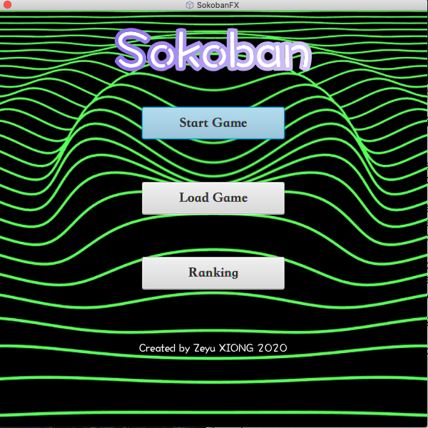
The Default starter page has three buttons: "Start Game (Default Button, with light blue)", "Load Game" and "Ranking".

StartGame: A new game will start.

LoadGame: A File chooser will be shown, then choose .skb file to load a game.

Ranking: A ranking list will be shown, with top5 players record.

## Ranking
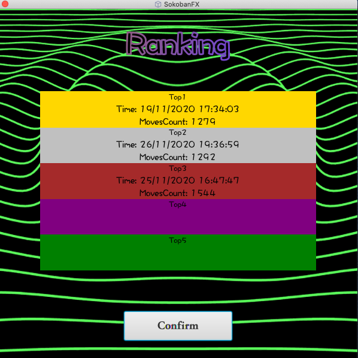
For example, there are three records stored in the ranking list.
If there are more than five records, the rankings will be sorted and display the top 5.
If "Confirm" button is clicked, then it will turn back to the default page.

## SaveGame
After you click "StartGame", you will enter the game. 
If you want to save a game, then just click "File" at MenuBar, then click "SaveGame".

Then a file chooser will be shown like this:
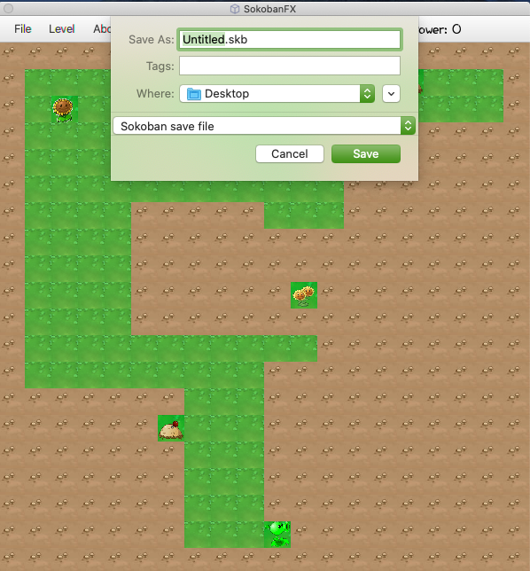
You can modify the name of the .skb file as you like, and save it.

## LoadGame
For example, you just saved a .skb file named "Untitled.skb", then you want to load it.
Click "File" at MenuBar, then click "LoadGame".

Then a file chooser will be shown, and you just choose "Untitled.skb" to load this file.

## Exit
There are two ways to exit the game:

    1. FastKey: E
    2. At menuBar, click "File", then click "Exit".

Then an alert dialog will be shown like this:
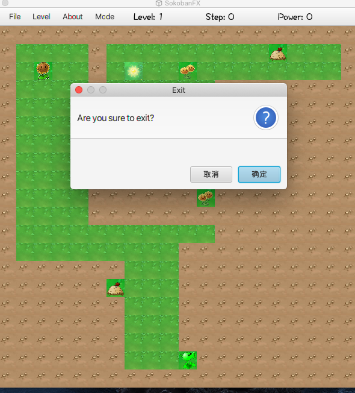
Then click "yes" to exit the game.

## Undo & Reset Level
Undo is aimed to reverse a step that you mistakenly take.
At the initial state, undo and reset are disable.
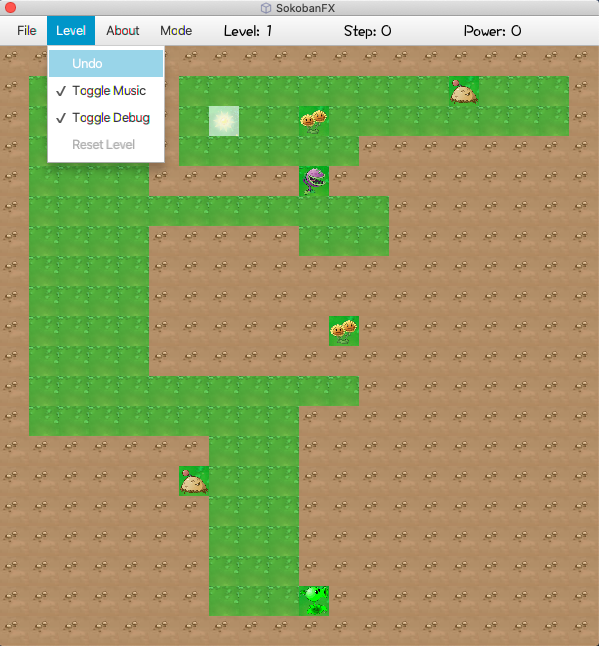
If you move, then undo and reset will be activated.
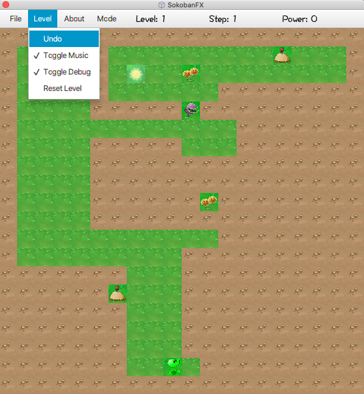
Then you can click "level" -> "undo" to reverse a step, or use the FastKey "B"". If you undo back to the initial state, the undo button will be set to disable.
If you enter Fastkey "B"  at the initial state, a dialog will be shown like this:
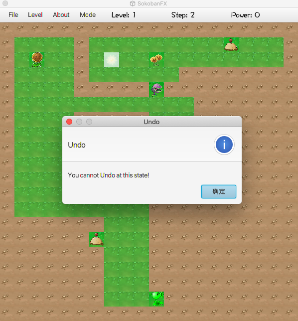

Notice: Undo is not free! Every step you undo, the step will not decrease but increase!!! Because you made a mistake when you play the Sokoban and you want to undo this, you must pay for it!

For undo implementation, a hashMap is used to store the user's (Direction, TargetOfKeeper). Every step you move, a tuple will be added to this hashMap, and for every step you undo, the tuple in the last will be removed and a moveBack function will be called.
The detailed method is in [GameEngine](src/main/java/com/ae2dms/GameEngine.java)

And for ResetLevel, for every level you can only reset it (back to the initial state) once without step change!!!


## Debug
The debug mode is activated when initializing the game, the diamond will shining and for every move, the details of the keeper object will be shown at the console.

## Music

### Default Music: Faster.mp3
To get access to the audio file;
We need more classes to handle this:
[javafx.scene.media](https://docs.oracle.com/javase/8/javafx/api/javafx/scene/media/package-summary.html#SupportedMediaTypes) and 
[Class MediaPlayer](https://docs.oracle.com/javase/8/javafx/api/javafx/scene/media/MediaPlayer.html#setOnEndOfMedia-java.lang.Runnable-)

1.Define url:      
```     
     String url=this.getClass().getClassLoader().getResource("music/Faster.mp3").toExternalForm();
     Media media =new Media(url);
```
    

2.Create MediaPlayer:
```
    MediaPlayer mediaPlayer =new MediaPlayer(media);
```

At this point the code [may not run](https://stackoverflow.com/questions/53237287/module-error-when-running-javafx-media-application) , we need to make sure javafx.media is resolved as a module from the module-path.


Including it in the VM arguments: 
`--add-modules javafx.media`
Then it should be runnable.

However, another issue comes out: the audio interrupted. 
That is related to lifecycle of a media player.

3.Make it as a field instead of just instances in method: (Extend Lifecycle)
```
    this.mediaplayer = mediaPlayer;
```

If we want to make it play in loops, then we can add an event listener.

4.Loop Play: (Add Event Listener):
```
    mediaPlayer.setAutoPlay(true);
    mediaplayer.setOnEndOfMedia(new Runnable(){
        @Override
        public void run() {
            System.out.println("Stopped!");
            // Loop Play
            mediaplayer.seek(Duration.ZERO);
            mediaplayer.play();
        }
    });
```
     

## About
Change Text: Font Family & Font Size
Dependency: [javafx.scene.text.Font](https://docs.oracle.com/javase/10/docs/api/javafx/scene/text/Font.html)

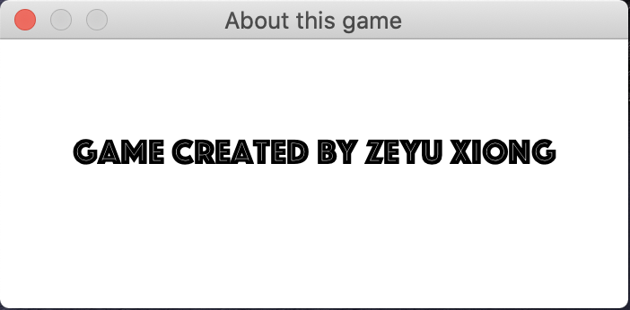

## Design Patterns

### 1. Factory 
Class [GameObject](src/main/java/com/ae2dms/GameObject.java) and its extenders (Wall, Crate, Diamond, Floor, Crate_On_Diamond, Keeper) are not directly accessed to Class [MenuController](src/main/java/com/ae2dms/Controller/MenuController.java), we use a [GraphicObjectFactory](src/main/java/com/ae2dms/Controller/GraphicObjectFactory.java) to get access to it.

In [MenuController](src/main/java/com/ae2dms/Controller/MenuController.java): (Call GraphicObject Indirectly)
```
GraphicObjectFactory graphicObjectFactory = new GraphicObjectFactory();
        switch (gameObject) {
            case WALL:
                gameGrid.add(graphicObjectFactory.getWall(mode), location.y, location.x);
                break;

            case CRATE:
                gameGrid.add(graphicObjectFactory.getCrate(mode), location.y, location.x);
                break;

            case DIAMOND:
                gameGrid.add(graphicObjectFactory.getDiamond(mode), location.y, location.x);
                break;

            case KEEPER:
                gameGrid.add(graphicObjectFactory.getKeeper(mode), location.y, location.x);
                break;

            case FLOOR:
                gameGrid.add(graphicObjectFactory.getFloor(mode), location.y, location.x);
                break;

            case CRATE_ON_DIAMOND:
                gameGrid.add(graphicObjectFactory.getCrate_On_Diamond(mode), location.y, location.x);
                break;

            case GATE:
                gameGrid.add(graphicObjectFactory.getGate(mode), location.y, location.x);
                break;

            case LOCK:
                gameGrid.add(graphicObjectFactory.getLock(mode), location.y, location.x);
                break;

            case POWER:
                gameGrid.add(graphicObjectFactory.getPower(mode), location.y, location.x);
                break;


            default:
                String message = "Error in Level constructor. Object not recognized.";
                GameEngine.logger.severe(message);
                throw new AssertionError(message);
        }
```

In [GraphicObjectFactory](src/main/java/com/ae2dms/Controller/GraphicObjectFactory.java):
```
    public Crate getCrate(int mode) {
        return new Crate(mode);
    }
    public Diamond getDiamond(int mode) {
        return new Diamond(mode);
    }
    public Floor getFloor(int mode) {
        return new Floor(mode);
    }
    public Keeper getKeeper(int mode) {
        return new Keeper(mode);
    }
    public Crate_On_Diamond getCrate_On_Diamond(int mode) {
        return new Crate_On_Diamond(mode);
    }
    public Gate getGate(int mode){
        return new Gate(mode);
    }
    public Lock getLock(int mode){
        return new Lock(mode);
    }
    public Power getPower(int mode){
        return new Power(mode);
    }
```

### 2. Singleton
Class [Main](src/main/java/com/ae2dms/Main.java), [Ranking](src/main/java/com/ae2dms/Ranking.java) and [GameLogger](src/main/java/com/ae2dms/GameLogger.java) cannot be instantiated from outside, it is initialized only once during the runtime.
For example, in class [Main](src/main/java/com/ae2dms/Main.java):
```
    private static Main main = new Main();
    private Main(){}
    public static Main getInstance(){
        return main;
    }
```

And we try to call it like this:
```
Main main = Main.getInstance(); 
```

### 3. Observer
Class [Subject](src/main/java/com/ae2dms/Observer/Subject.java) defines the state and notify all observers if the state updates.
Class [Observer](src/main/java/com/ae2dms/Observer/Observer.java) is an abstract class, which is implemented by Class [LevelStepObserver](src/main/java/com/ae2dms/Observer/LevelStepObserver.java) and Class [StarObserver](src/main/java/com/ae2dms/Observer/StarObserver.java)

Class [LevelStepObserver](src/main/java/com/ae2dms/Observer/LevelStepObserver.java) observes the step (moves count) displayed in menu bar
Class [StarObserver](src/main/java/com/ae2dms/Observer/StarObserver.java) observes the star displayed in menu bar

In Class [MenuController](src/main/java/com/ae2dms/Controller/MenuController.java):
```
   //Observer Design Pattern
   Subject subject = new Subject();
   LevelStepObserver levelStepObserver = new LevelStepObserver(subject);
   PowerObserver powerObserver = new PowerObserver(subject);
```
Then in method `public void level_step_fresh()`:
```
    subject.setStepState(gameEngine.getMovesCount());
    subject.setPowerState(gameEngine.getPowerCount());
    this.stepText.setText("Step: " + levelStepObserver.step);
    this.powerText.setText("Power: " + powerObserver.power);
```

### 4. MVC (Model - View - Controller)

View: [Default](src/main/resources/interface/Sokoban.fxml) 

Controller: [GameStartController](src/main/java/com/ae2dms/Controller/GameStartController.java)

Model: [GameStart](src/main/java/com/ae2dms/GameStart.java)


View: [Menu](src/main/resources/interface/Menu.fxml) 

Controller: [MenuController](src/main/java/com/ae2dms/Controller/MenuController.java)

Model: [Main](src/main/java/com/ae2dms/Main.java)


View: [Ranking](src/main/resources/interface/Ranking.fxml) 

Controller: [RankingController](src/main/java/com/ae2dms/Controller/RankingController.java)

Model: [Ranking](src/main/java/com/ae2dms/Ranking.java)


## New Feature

### 1. Level/Step show in the menu bar
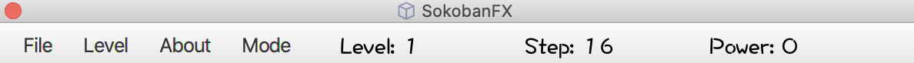

Level: The current Level you are in.

Step: The total steps you move.

Power: The power you get (The power can be used to unlock the way (eliminate man eater) or blow up the wall).

### 2. Brand New GameGrid Interface (Plant vs Zombie)
Plant Mode: The sunflowers have some healthy problem that they cannot be able to generate sun by themselves. The shooter needs to push sunflowers to get sunlight.
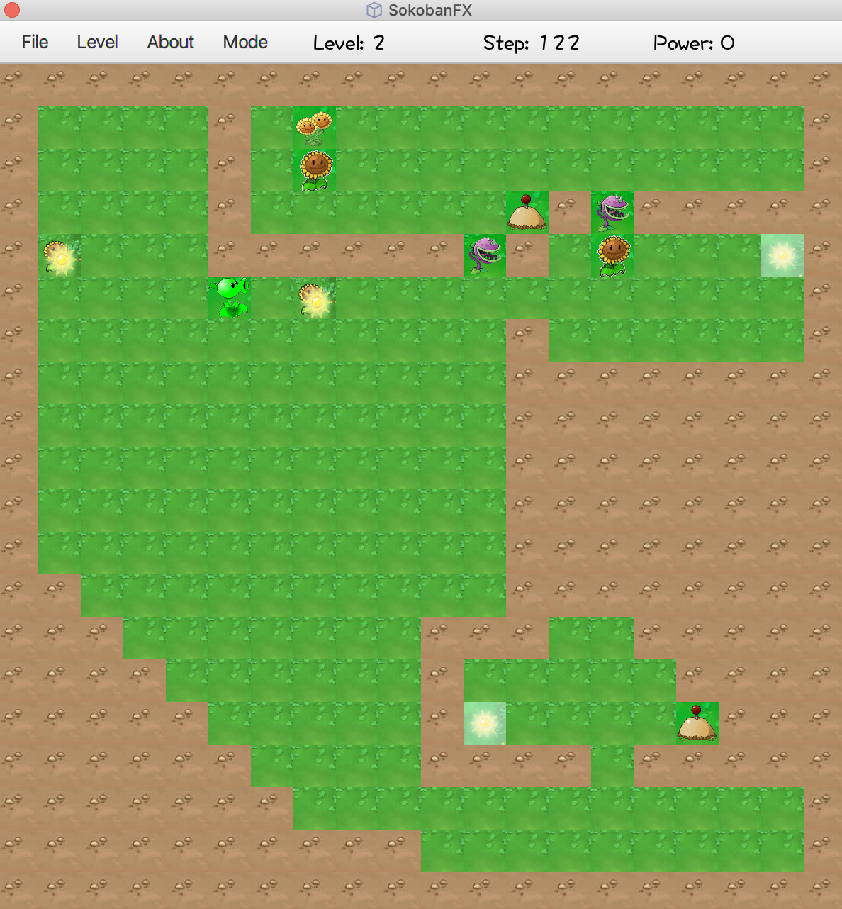

Zombie Mode: The normal zombie cannot break down the hard nut, they must move them to the hat zombie to handle this.
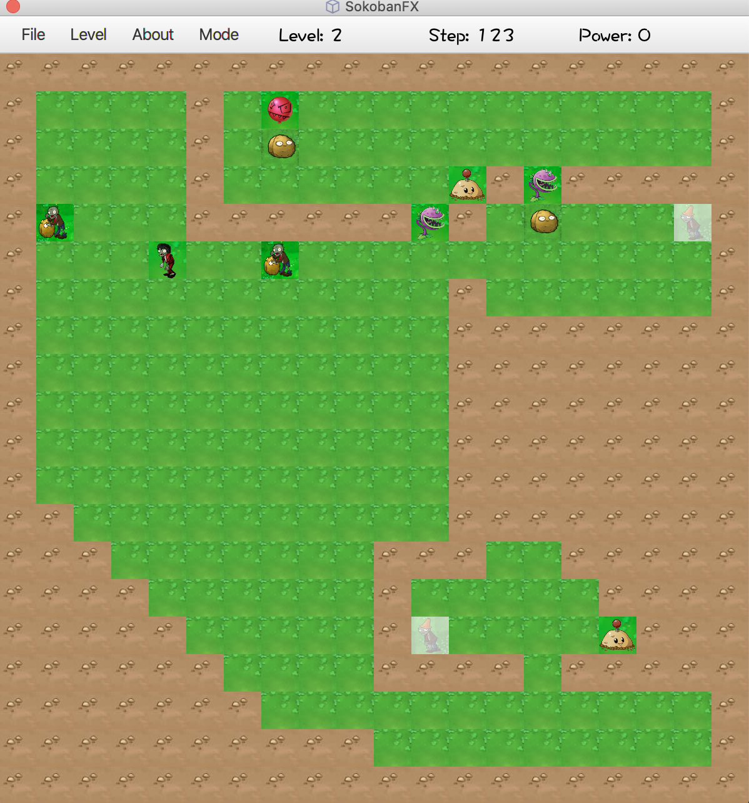

### 3. Fast Key

    1. W A S D: Up Left Down Right
    2. E: Exit
    3. B: Undo
    4. M: Toggle Music

### 4. Transfer Gate
Step into a transfer gate (potato mine), the keeper will get out from the other transfer gate.
For example, in state of the picture below, the keeper try to move RIGHT (RIGHT is a potato mine):
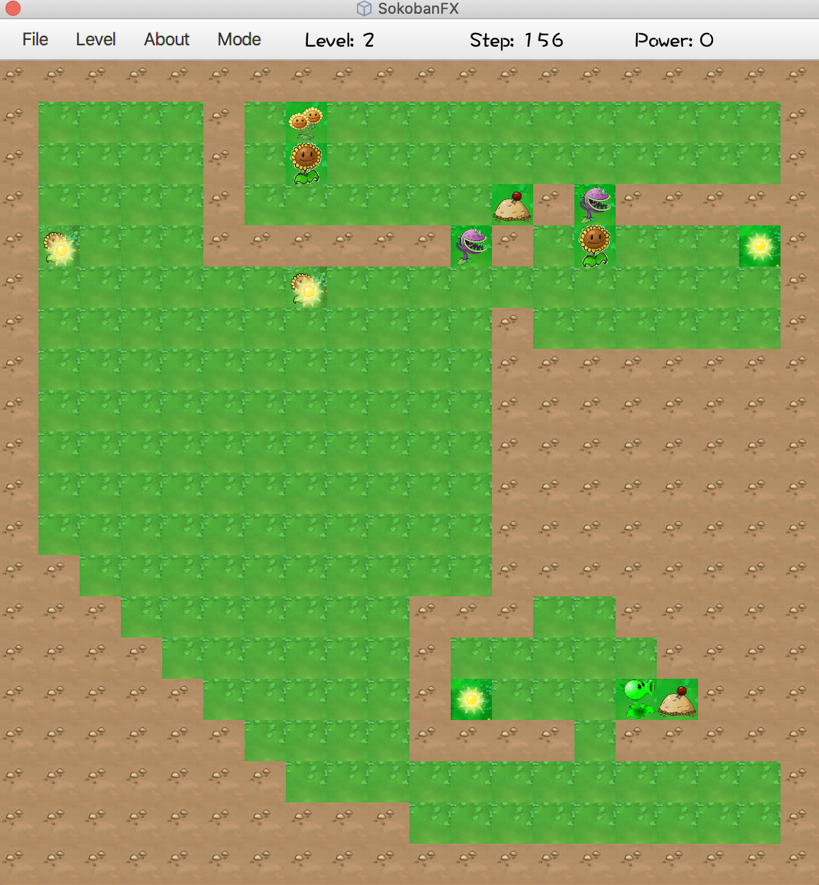
Then the keeper will in the position of the other potato mine:


### 5. Locked Way
In plant mode, the shooter needs a two-headed sunflower to gain power to become ice shooter to break the locked gate.
In zombie mode, the zombie needs a balloon to fly over the locked gate and breaks the lock.

For example, in plant mode: 

In state of the picture below, the keeper try to move LEFT (LEFT is a two-headed sunflower):
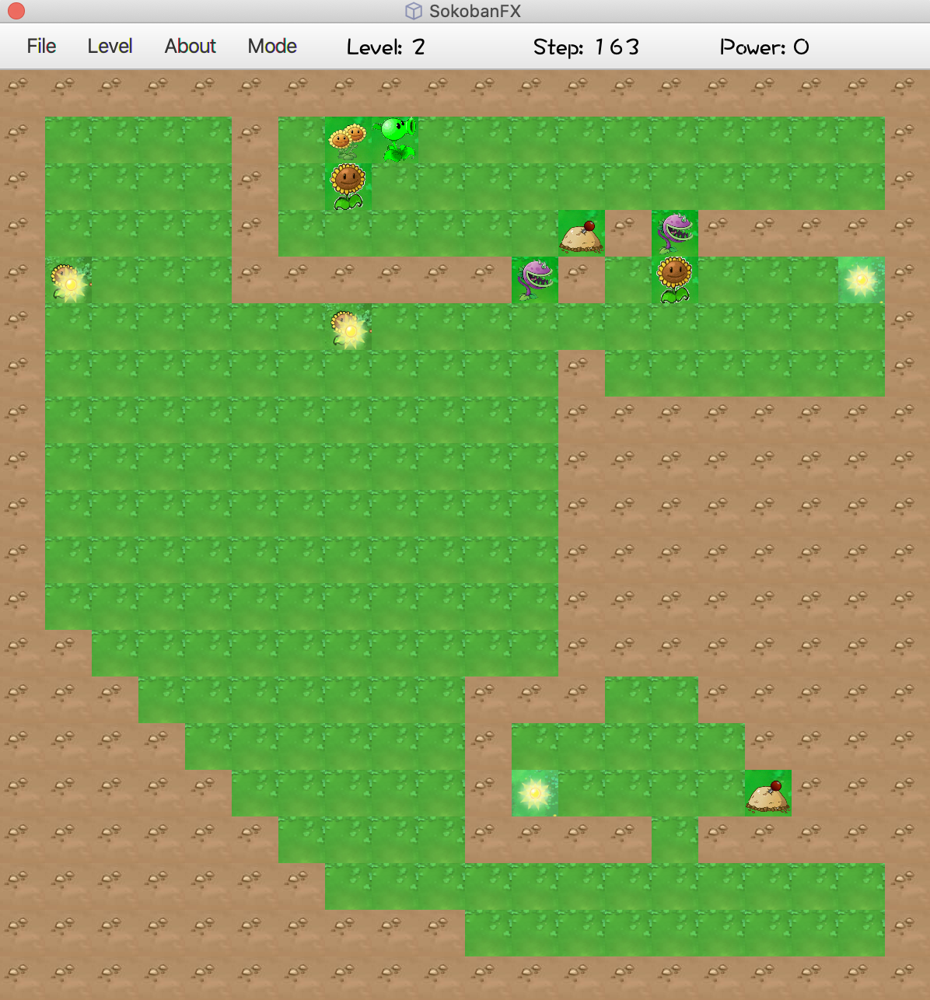
Then you will gain 3 powers, and if the keeper's power is bigger than 0, the keeper will change a shape.
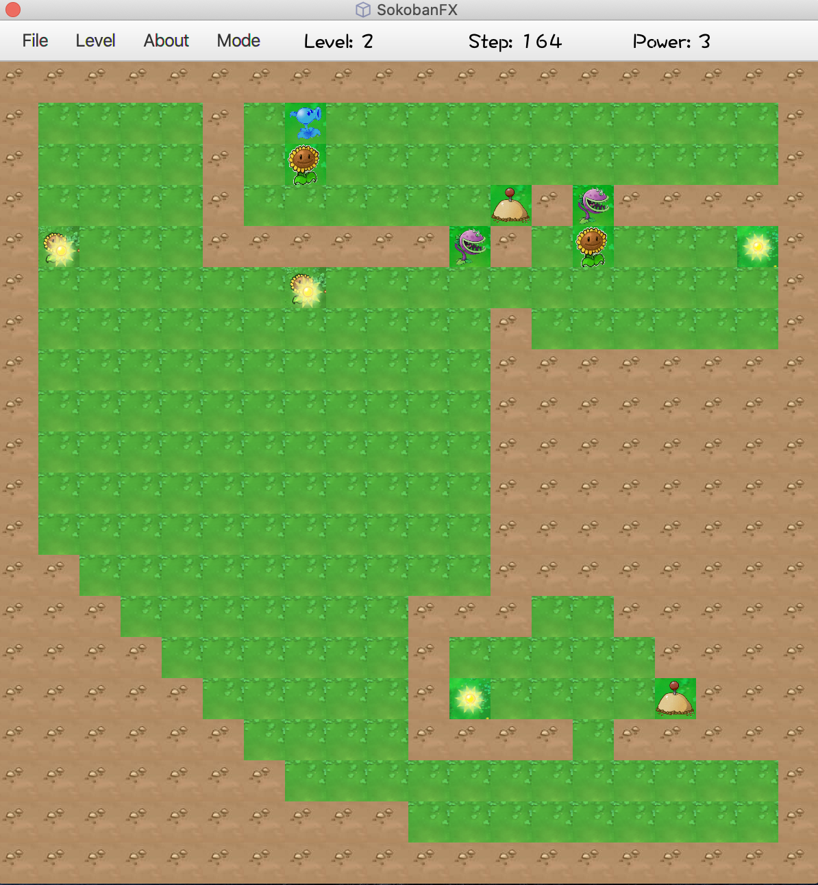
Then move this keeper to the locked way (man eater):
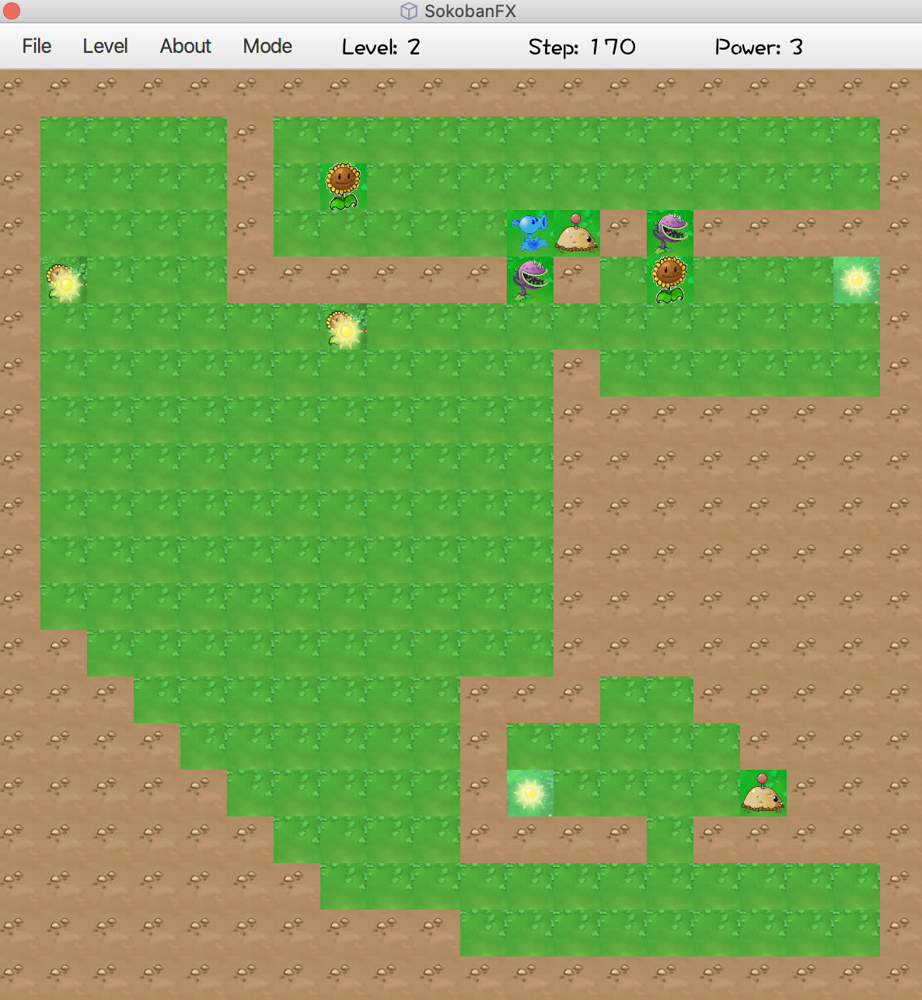
Then the keeper trys to move DOWN (DOWN is a man eater (loacked way)):
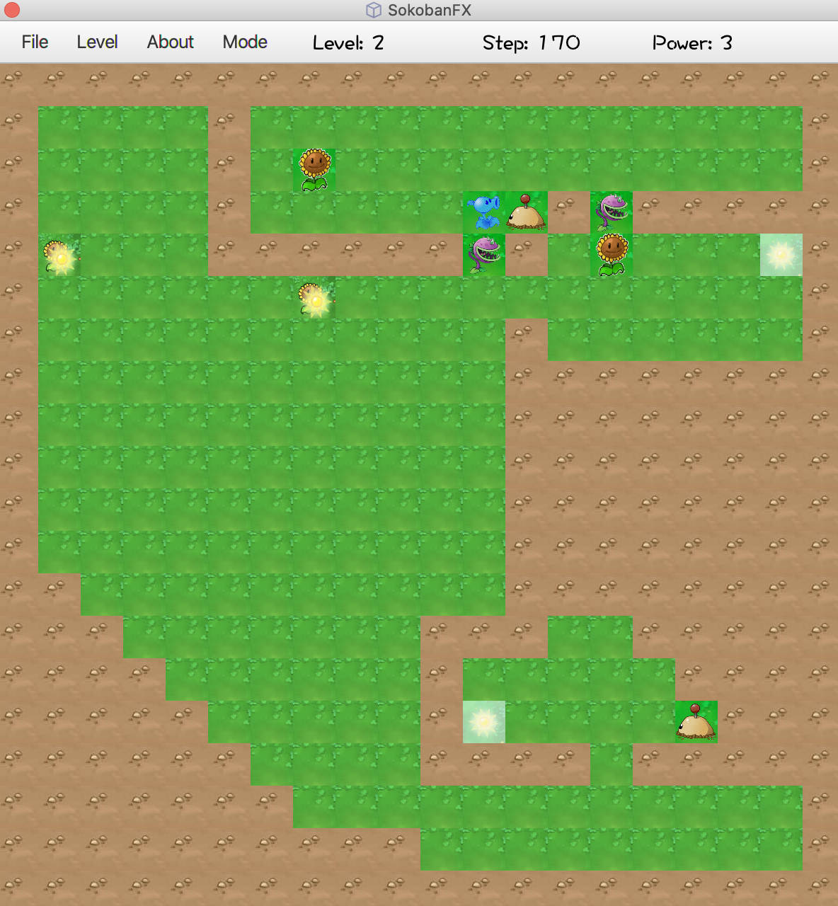
Then the power reduced by one, and the man eater has gone (unlocked).


### 6. Blow Up Wall
Blowing one grid of wall will consume three points of power.
If power is enough, it will firstly ask you to confirm blowing up the wall.
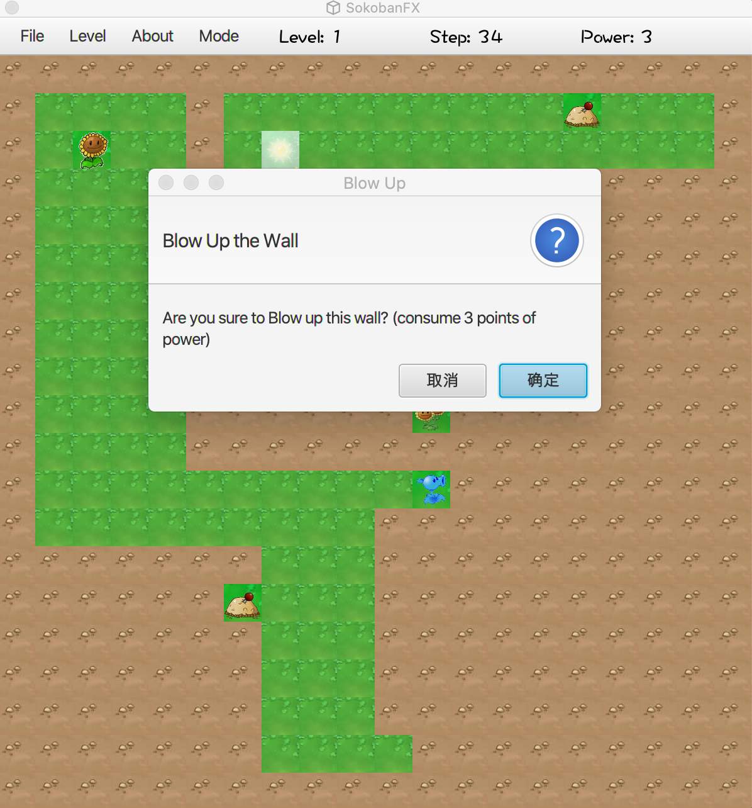
Click Yes, then the wall will be blowed up to floor (3 points of power have been consumed)
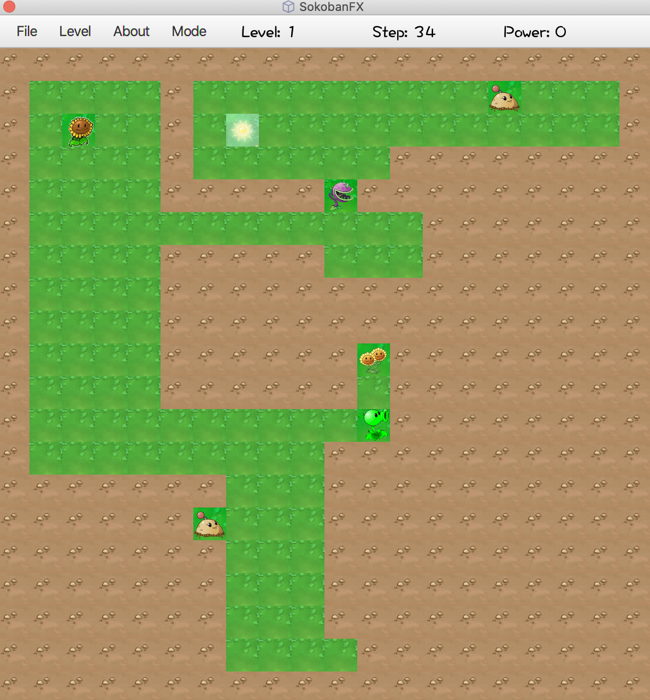


## Test
TestFX is used as a framework to do the unit test for this sokoban game.
And based on JUnit5, the classes are tested.
For example, in [GameEngineTest](src/test/java/com/ae2dms/GameEngineTest.java), the methods have been tested with the game file in [debugGame.skb](src/test/java/resources/debugGame.skb).
Besides, for controller testing, the TestFX has been used to simulate keycode and mouse click.
For example, you can run [MenuControllerTest](src/test/java/com/ae2dms/Controller/MenuControllerTest.java) to have a try.
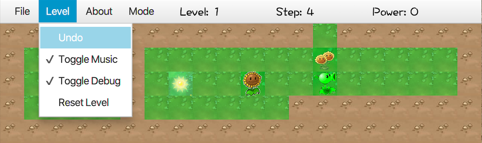
The picture shows the test of "undo" in MenuController.

## JavaDoc
The Specified JavaDoc file is in [index.html](javadoc/index.html), you can have a look at it.

Enjoy the Game!
